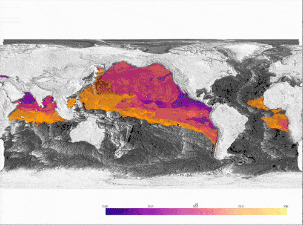

# A collection of example using pyvista-xarray

## Integrations

### Icechunk

**`scripts/icechunk_timetravel.py`** shows a mini app that demonstrates how to visualize changes to a dataset when looking at different snapshots.

```bash
uv run panel serve /Users/juliusbusecke/Code/pv-xarray-gallery/scripts/icechunk_timetravel.py --show
```


## Data Examples

**`scripts/omz.py`** shows an animation over the climatology of Oxygen Minimum Zones (from World Ocean Atlas Data) in relation to the ocean bathymetry.

```bash
uv run scripts/omz.py
```
>[!NOTE]
> The script was run from a local copy of the very high res bathymetry data. The streaming version (commented out) will basically download the entire netcdf file. I am planning to upload this data to source.coop at some point in the future. 

