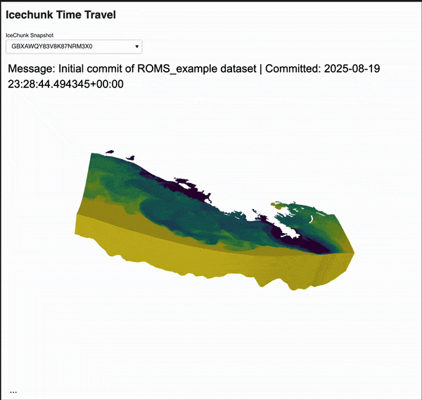

# A collection of example using pyvista-xarray

## Integrations

### Icechunk

**`scripts/icechunk_timetravel.py`** shows a mini app that demonstrates how to visualize changes to a dataset when looking at different snapshots.

```bash
uv run panel serve /Users/juliusbusecke/Code/pv-xarray-gallery/scripts/icechunk_timetravel.py --show
```

